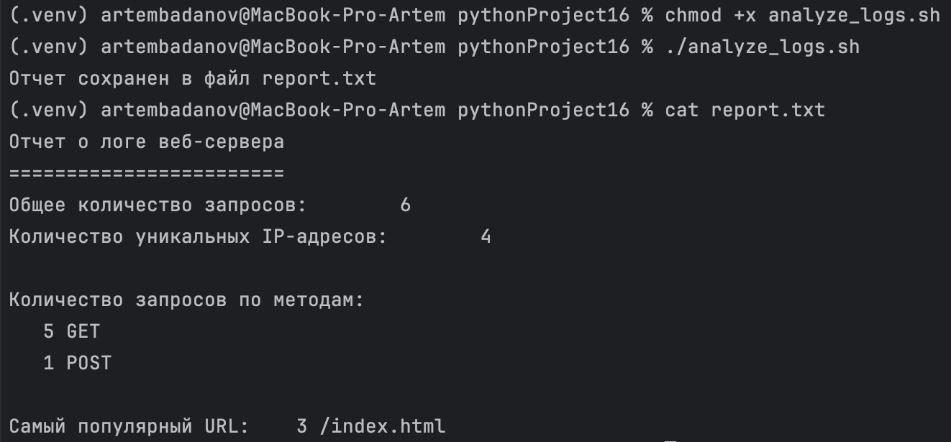

# Итоговое задание  №6
Используя полученные в этом разделе знания, решите следующую задачу.  
Представляем себе ситуацию, что мы находимся внутри сервера и нам необходимо провести анализ логов, которые там есть. Но, ничего кроме Bash и Linux там нету, а сделать нужно быстро и эффективно.  Поэтому необходимо решить задачу, используя только эти инструменты.
Команда для генерации логов выглядит следующим образом -  
```
    cat <<EOL > access.log  
    192.168.1.1 - - [28/Jul/2024:12:34:56 +0000] "GET /index.html HTTP/1.1" 200 1234  
    192.168.1.2 - - [28/Jul/2024:12:35:56 +0000] "POST /login HTTP/1.1" 200 567  
    192.168.1.3 - - [28/Jul/2024:12:36:56 +0000] "GET /home HTTP/1.1" 404 890  
    192.168.1.1 - - [28/Jul/2024:12:37:56 +0000] "GET /index.html HTTP/1.1" 200 1234  
    192.168.1.4 - - [28/Jul/2024:12:38:56 +0000] "GET /about HTTP/1.1" 200 432  
    192.168.1.2 - - [28/Jul/2024:12:39:56 +0000] "GET /index.html HTTP/1.1" 200 1234  
    EOL 
``` 
Ваша задача написать к этому файлу с логами несколько команд и упаковать их в .sh скрипт, а именно -  
- Подсчитать общее количество запросов.  
- Подсчитать количество уникальных IP-адресов. Строго с использованием awk.  
- Подсчитать количество запросов по методам (GET, POST и т.д.). Строго с использованием awk.  
- Найти самый популярный URL. Строго с использованием awk.  
- Создать отчет в виде текстового файла. Название текстового файла - report.txt  

Результат, который должен получиться при запуске analyze_logs.sh следующий-



В качестве ответа приложите ссылку на git. В репозитории должны находиться :
1. Файл analyze_logs.sh с кодом на языке bash.  
2. Файл, который получился при выполнении analyze_logs.sh  
3. Cкриншот, как сверху, где отчетливо видно, что скрипт запускается, скрипт сделался исполняемым и команда cat к файлу report.txt работает.